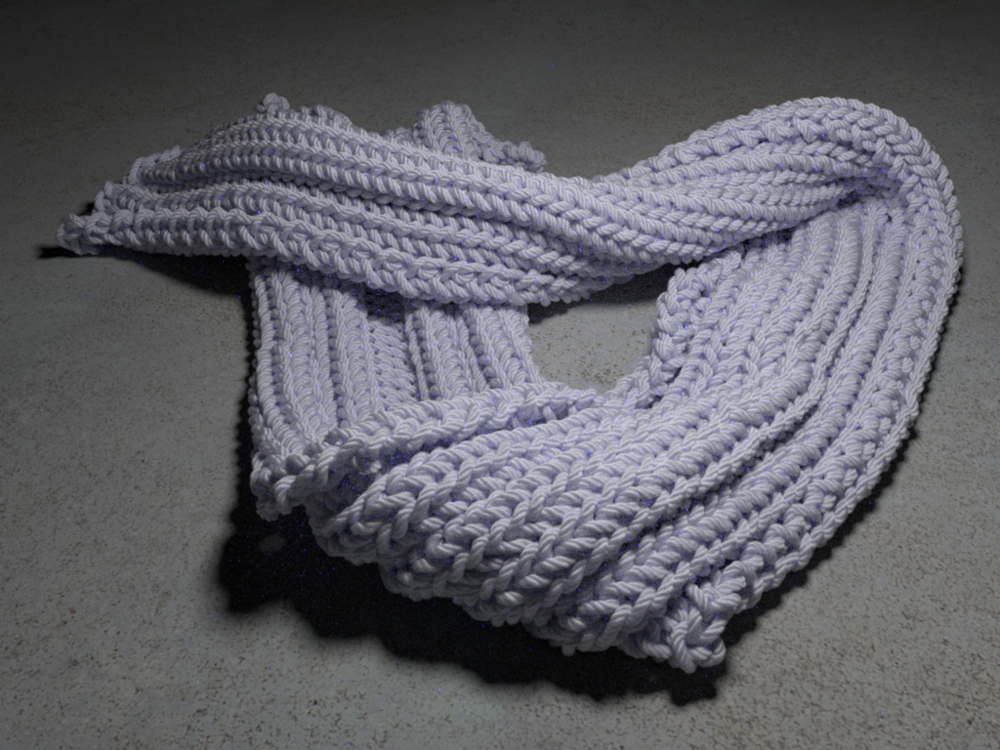
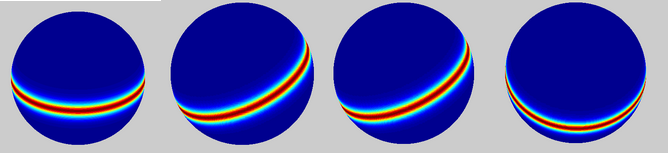
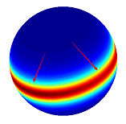
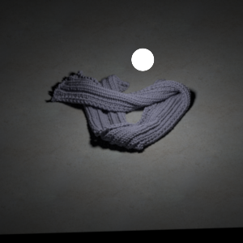

# SGGX-Plugin-for-Mitsuba
A implementation for SIGGRAOH 2015 paper [*The SGGX Microflake Distribution*](https://drive.google.com/file/d/0BzvWIdpUpRx_dXJIMk9rdEdrd00/view?usp=sharing) within the [*Mitsuba*](www.mitsuba-renderer.org/) framework.

The paper propose a novel expression for microflake distribution which use projected area to represent the distribution. The new distribution can be easily converted from previous expression proposed by Zhao et al. And the coefficients can also be estimated from arbitary distribution. 

-*Scarf*

This distribution also quite quite well when interpolated. 

 

Finally, this distribution works well when used to generate LOD data.

-*Reference*

 

-*4x4 downsampling*

- - -
This repo includes the code need to be added or modified in the Mitsuba source code. The full source code can be dowloaded [*here*](http://www.mitsuba-renderer.org/download.html). 

The scarf model used in the example can also be dowloaded [*here*](http://www.mitsuba-renderer.org/download.html).
